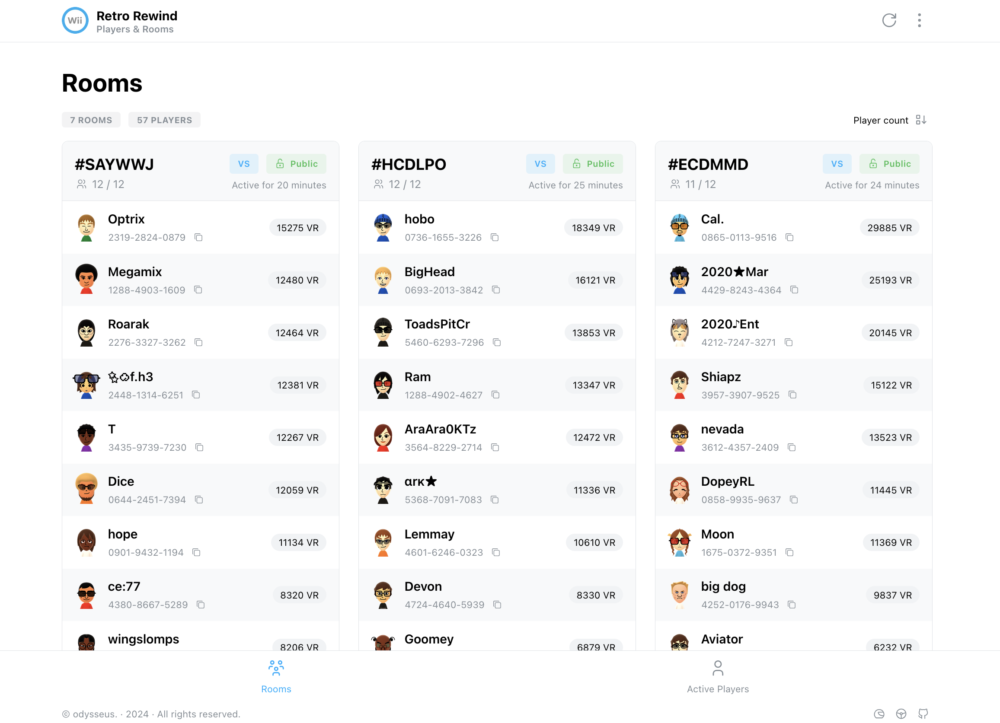

# 🏎️ RR App

[](https://app.netlify.com/projects/heyfordys-rwfc-app/deploys)


A web application for viewing rooms and tracking players currently playing ZPL's Mario Kart Wii mod [Retro Rewind](https://wiki.tockdom.com/wiki/Retro_Rewind). Maintained by [Bitte ein Git!](https://github.com/Bitte-ein-Git).

## Screenshots




## Features

-   Fetch currently active rooms via [RWFC API](https://api.heyfordy.de/rwfc), including dynamic auto-refreshing
-   Search by player name
-   Sort by room name, player count or average VR/BR
-   Responsive design and dark mode
-   iOS "Add to Home Screen" compatible

## Run Locally

Clone the project

```bash
git clone https://github.com/Bitte-ein-Git/rr_app.git
